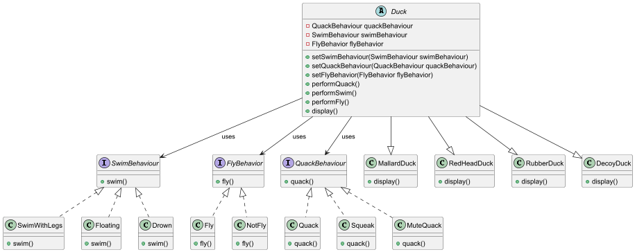

# 🦆 Strategy-Pattern

## 📌 Overview

This **Duck Simulation** project demonstrates the **Strategy Pattern** by encapsulating different duck behaviors (flying, swimming, and quacking) into separate interfaces and implementations. The program follows **Object-Oriented Programming (OOP) principles**, making it flexible and extensible.

## 🎯 Features

- Implements **Strategy Pattern** for interchangeable duck behaviors.
- Uses **Encapsulation & Polymorphism** to manage behaviors efficiently.
- Supports **multiple types of ducks**, each with unique behaviors.
- Follows **coding guidelines** with proper modularity and comments.

## 🏗️ Project Structure

```
Strategy-Pattern/
│── behaviors/
│   ├── quack/
│   │   ├── QuackBehaviour.java
│   │   ├── Quack.java
│   │   ├── Squeak.java
│   │   ├── MuteQuack.java
│   ├── swim/
│   │   ├── SwimBehaviour.java
│   │   ├── SwimWithLegs.java
│   │   ├── Floating.java
│   │   ├── Drown.java
│   ├── fly/
│   │   ├── FlyBehaviour.java
│   │   ├── Fly.java
│   │   ├── NotFly.java
│── ducks/
│   ├── Duck.java
│   ├── MallardDuck.java
│   ├── RedHeadDuck.java
│   ├── RubberDuck.java
│   ├── DecoyDuck.java
│── Main.java
│── DuckclassDiagram.png
│── classDiagram.puml (PlantUML Class Diagram)
│── README.md
```

## 📜 Class Descriptions

### 🦆 Duck (Abstract Class)

- `performQuack()`, `performSwim()`, `performFly()` – Executes assigned behaviors.
- `setQuackBehaviour()`, `setSwimBehaviour()`, `setFlyBehavior()` – Allows dynamic behavior change.
- `display()` – Implemented by subclasses to define duck appearance.

### ✈️ FlyBehavior (Interface)

Defines `fly()` method. Implemented by:

- `Fly` (can fly)
- `NotFly` (cannot fly)

### 🌊 SwimBehavior (Interface)

Defines `swim()` method. Implemented by:

- `SwimWithLegs` (active swimming)
- `Floating` (passive floating)
- `Drown` (no swimming ability)

### 🔊 QuackBehavior (Interface)

Defines `quack()` method. Implemented by:

- `Quack` (normal quacking)
- `Squeak` (rubber duck squeak)
- `MuteQuack` (silent duck)

### 🦆 Duck Subclasses

- **MallardDuck**: Quacks, swims with legs, can fly.
- **RedHeadDuck**: Quacks, swims with legs, can fly.
- **RubberDuck**: Squeaks, floats, cannot fly.
- **DecoyDuck**: Silent, drowns, cannot fly.

## 🛠️ Setup & Run

### **💻 Prerequisites**

- **Java 8+** installed.
- **IntelliJ IDEA** (Recommended) or any Java IDE.

### **🚀 Running the Project**

1. **Clone the Repository**
   ```sh
   git clone https://github.com/your-username/Strategy-Pattern.git
   cd Strategy-Pattern
   ```
2. **Compile & Run**
   ```sh
   javac *.java
   java Main
   ```

## 📌 UML Class Diagram

The UML Class Diagram for this project is generated using **PlantUML**.




## 🛠️ Future Enhancements

- 🦆 Add more duck types (e.g., **Wood Duck**, **Pekin Duck**).
- 🌟 Improve behavior customization using **Factory Pattern**.
- 🔧 Implement GUI using **JavaFX**.
